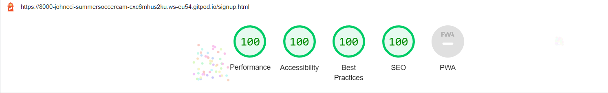
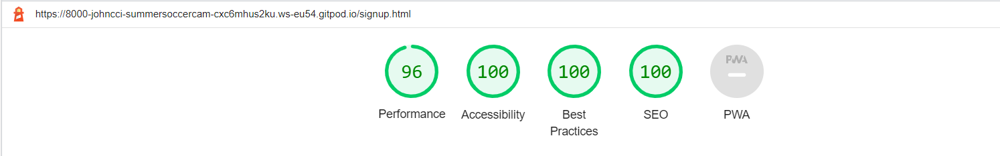

<h1 align="center">Summer Soccer Camp</h1>

## <U>**Motivation**</U>
The Summer Soccer Camp website was created to advertise a soccer camp for kids in suncroft, co. Kildare. It's goal is to encourage parents to sign up their kids to our soccer camps. My motivation for this project is based on my own involvement with training kids from a young age. When I was growing up there was no such facilities or programs in place. I want to create something to give all children a great chance to develop there football abilities from a young age and to make new friends. I have found it is a great way to help them develop both physically and mentally.

The Summer Soccer Camp website is aimed at both parents and their children. The Initial view of the website will most likely be from a parent and the information provided is relative to the parent. The imagery of the website were created with the intention of making it easier for both the parent and child to gain an insight into what the camp involves. The overall aim is that the easy to find information and the imagery will allow both parent and child to reach what is often a mutual decision to attend this summer camp.

## <u>**Features**</u> ##

The following are images of the entire site and a brief description of the value each feature provides for the user. 
 

### **Existing Features** ###
 

* **Navigation Bar**

  * Featured on all three pages, the naviagtion bar located at the top of the page is fully responsive and includes links to the Logo, Home Page, About Us section, Gallery and Sign Up page. The navigation bar is identical in each page to allow easy navigation.

  * The Navigation bar will allow users to navigate easily from page to page. The links are consistent on each page to allow the user access to any plave on the website from every page. The one exception is the About us link which brings the user to content in the middle of the home page from anywhere in the website.

   

  

   

* **Landing page Image**

   * The Landing page is a photograph from a previous soccer camp. It has a text circle with the age requirements contained inside. It also has a quote from a famous sports personality underneath the image.

   * This section displays an image from a previous soccer camp. It shows kids having fun performing an exercise. It is intended through the text and the image to show the age requirements and the fun that can be had at the camp. The quote is directly aimed at the parents or guardians of the child to encourage participation.

    

   

    

## <u>**User Experience**</u>

### **Initial Discussion**

The Summer Soccer camp is an online webapge that introduces potential clients from a localised area to a week long soccer camp for kids. The pages include past images of the camp, a simple online registration form and a brief description of what activities kids will be able to participate in at the camp. It also includes an interactive google map segment which allows users to view directions to the camp.

### **Key Information**

* What we do at the camp.
* Where the camp is located.
* How do I sign up.
* The level of qualifications held by coaches.
* The cost of the camp.
* The gift for the children on completion of the camp.
* That Parents must attend for supervision purposes.
* The age requirement to attend the camp.

### **Client Goals**

* To be able to view the site on a range of devices including a smartphone , a tablet and a laptop.
* To make the site informative without having to much information to allow users to easily see the essential details.
* To provide easy navigation throughout the site so users can easily navigate to and from different pages and sections of pages.
* To provide a simple sign up form to allow users to register in seconds.
* To provide a method of locating the camp.

### **First Time Visitor Goals**

* I want to find out what the camp is and how I can sign my child up.
* I want to be able to navigate the site with ease to collect all the information I require to make a decision on joining.
* I want to be able to navigate to the social media platforms to gain further perspective on the camp.

### **Returning Visitor Goals**

* I have talked to the relevant people at home and now want to return to sign up for the camp.
* I want to be able to contact the camp with any questions I may have.
 
### **Frequent Visitor Goals**

* I want to return to this site for updates on new camp dates in the future.

## <u>**Designs**</u>

### **Colour Scheme**

The below image was taken from the website colorhexa.com and it is an eaxample of the main colour displayed in this site. The original colour picked was a light green colour with a value of #ccf381. This colour was chosen in place of #ccf381 as it is considered a web safe colour as shown in colorhexa.com. 
The other colours displayed on the site are whitesmoke and black. The whitesmoke colour was chosen for the purpose of emphasising the foreground display. Black was used for all font colours with red used for all hover actions.

The website used for the colour scheme is [Color hexa](https://www.colorhexa.com/ccff99). I have attached a screenshot of the particular colour used.

### **Font-family**

The following Google Fonts were used for this site:

* Roboto was used for the headings on the site. It is a Sans-Serif font. The back up font selected was San-Serif.

* Lato was used for the body of the site. It is also a Sans-Serif font. The back up Font selected was Sans-Serif.

### **Imagery**

All imagery was used with the permission of their owners. I have credited all of these in the Credits section of this README.md File.

### **Site Layout**

The website consists of three seperate pages with a home page extended into sections. All pages are accessible from the navbar at the top of the pages. 

## <u>**All Pages**</u>

All pages on this website have a reponsive navigation bar at the top. The navigation bar is located on the right of the page opposite the main header. It is diplayed horizontally across the header. The navigation bar displays vertical with disks on mobile screen sizes. The main logo in displayed on the left on all pages. It is displayed horizontally but the words stack on top of one another on mobile devices to allow sapce in the main header and avoid cluttering.
The footer is displayed on all pages and it does not change its layout. It was made responvie throught he use of Flex elements. The social media icons on the footer narrow in width but maintain an equal space as the page gets smaller. The wording for each social media icon will move underneath the icons when the page width reaches 487px.

### **Home Page**

* Main Image Section: The main image shows kids playing football in front of goalposts. It is intended to highlight the age profile of kids that can attend the summer camp to attract all age groups that are within the age brackets. There is a text circle within the image highlighting the age requirements. There is a bar containing text underneath the main image. This is a quote from a famous sports person intended to encourage signing up.

* About Us Section: The about us section consists of two parts which are layed out horizontally on larger screens and on smaller screen sizes, the image will move underneath the text. The text displays on the left and gives the essential information about the summer camp with contact details for any further queries. The image is of a football sitting in the middle of a football field.

* Google map section: The Google map is displayed at the bottom of the screen above the footer. It is an interactive map that allows users to see where the summer camp will be held.

### **Gallery**

* The gallery is a small collection of images from previous camps. Its purpose is to give the viewer a better understanding of what the camp entails. The images will display in two columns on larger screens and in a vertical column on tablet and mobile devices.

### **Sign Up**

* The sign up page is a single page with a background image of a football net and a football. The foreground features a sign up form which asks the user for their information ,the childs information and an E-mail address.

## <U>**Accessibility**</U>

I have been conscientious of achieving the maximum amount of accessibility possible by completing the following actions:

* Using semantic HTML.

* Using alt attribute with images on the site. There are two exceptions to the use of alt attributes. The first is the main image on  the home page which has a text circle inserted to assist screen readers and the background image on the sign up page which is there for background decorative purposes.

* Ensuring sufficent colour contrast throughout the site

* Adding text to the social media elements on the footer to assist screen readers.

## <U>**Technologies Implemented**</U>

* HTML and CSS - To create this website.

* Git - For version control.

* Github - To save and store the files for the website construction.

* Google Fonts - To import the fonts used on the website.

* Font awesome - To create the social media icons on the footer.

* Google dev tools - To troubleshoot and test features and to monitor and adjudt the website to ensure it is responsive.

* Tiny PNG - To compress images.

* Am I Responsive? - To show the website image on a range of devices.

* Ezgif.com - To optimize images.

## <U>**Testing and Bugs**</U>

Testing was an ongoing process from the start to the finish of the build. I used a chrome developer tools to assist me in solving problems as I progressed through the project.

I encountered the following build issues and bugs as I progressed through the project:

1. The main image would not conform to my intended page size. At this point in the project I was using float elements to align my page. I then learned how to use flex properties and when I used flex properties I was able to align the main image.

2. The image in the about us section on the home page was creating a white margin on the right of the page when screen width reached 487px. I identified this issue using chrome developer tools. I applied an overflow value of hidden to the relevant media query to prevent this form happening.

3. The lighthouse test on developer tools is displaying a score of 75 for performance on the mobile text. I discussed this with my mentor and the possible explanation is the size of the main image and reached a conclusion which i discuss in the lighthouse section later in this readme.md file.

4. The form name element in the input id for parent did not have sufficient indiviual detail as highlighted by my mentor. This was causing a problem when submittimg the form as there are two submission fields for parent/guardian and child.

5. I encountered difficulty postioning in the home page with the about us section. I was using float properties at this time, I could not get the image div and the text div to display side by side. I spoke to my mentor about my positioning problems and he recommended flex positioning. I changed to flex and this resolved the issue.

## <U>**W3C Validator**</U>

### **Home Page HTML**

### **Gallery Page HTML**

### **Sign Up Page HTML**

### **CSS Validator**

## **Testing User Stories** 

### **First time visitors**

* I want to find out what the summer soccer camp is and are my children eligable to join up. The about us section answers these questions and also provide a contact method for any further questions. I also see text on the main image telling me the age eligibility. I see the links at the top of the page showing me where I can click for easy access to the relevant pages.

 

 

* I want to be able to access the social media profiles at the bottom of the page. These will open in a new browser window when selected. I want to use the google map to find the exact location for the camp. The social media icons also have text required for use of a screen reader. The coial media links open in a new window for a good user experience

 

 

* I want to access the past photos of the camp and gain an insight into what the camp involves by viewing the activities. I want to show these images to my children to encourage signing up to the camp.

 

 

### **Returning Visitors**

* I want to return to the page and access the sign-up form to sign up my children to the camp after having a discussion about the children's interest in the camp. I want to access the about us section to discuss any concerns i may have before signing my children up for the camp. 

 

 

## <u>**LightHouse**</u>

I applied the lighthouse tool to this project which is located in the Chrome Developer Tools. The four tests performed in this tool are:
 

* Performance
* Accessibility
* Best Practices
* SEO

 

### **Home Page**

The following images in this section are displayed as lighthouse desktop as the first image and lighthouse mobile as the second image.
 

1. The image below displays the lighthouse desktop score for the home page. The performance score was diplaying as 76 on a mobile device and 85 on a desktop device. I consulted with my mentor about the score and he imformed me the size of the main image was the problem.

2. I used the website [ezgif.com](https://ezgif.com/) to address this problem. I resized image and this increased the performance score to 99 on the desktop devices and 93 on the mobile devices. the increase in score came directly as a result of these changes as confirmed through retesting.

 

### **Gallery Page**

The following images in this section are displayed as lighthouse desktop as the first image and lighthouse mobile as the second image.
 

1. The Image displayed below displays a desktop score of 100 for every section. The mobile performance score was 86 for performance and 93 on desktop.

2. The performance issue was addressed by converting the largest image file to webp and by changing the aspect ratio of the images using exgif.com. I gave consideration to changing the remaining images but after viewing the images in a different format I decided to keep them as they were rather than gain one performance score point. The increase in score came directly from these changes as confirmed through retesting.

### **SIGN UP PAGE**

The following images in this section are displayed as lighthouse desktop as the first image and lighthouse mobile as the second image.
 

1. The background image on this page was effecting perfomance. The lighthouse suggestion was to serve the image in a next gen format. The original perfomance score was 89.

2. I addressed this issue by again using ezgif.com and and increased the score to 96. The background image also displays differently on different devices as it does not respond 

 

## **<u>Full Testing</u>**

* I performed testing on using the following browsers - Google Chrome ,Safari ,Mozilla Firefox.

* I performed testing on the following devices - Samsung S21+ , Samsung S10 and Huawei MateBook D15. I also used google chrome developer tools to check the sites responsiveness on all the different screen sizes.

 

### **links**

1. Test each link on the index page. Each link worked as expected, and any links leading to external pages opened correctly in a seperate browser tab.
2. Test each link on the gallery page. Each link worked as expected, and any links leading to external pages opened correctly in a seperate browser tab.
3. Test each link on the sign up page. Each link worked as expected, and any links leading to external pages opened correctly in a seperate browser tab.

 

### **Sign Up Form**

I performed multiple tests on the sign up form. These tests invovled attemptimg to submit the form with missing fields. The form would not allow me to submit with any missing fields. It redirected in order from top to bottom to the missing field.

* I filled out just the email address and attempted to enter and an icon appeared on the first name field at the top stating to fill out this field.

* I filled out the first name field and the email address and an icon appeared directing me to fill out the last name field.

* i filled out the first name field, the email address and the last name field and an icon appeared telling me to fill out the childs first name field.

* I filled out the first name field, the email address, the last name field and the childs first name field and an icon appeared telling me to fill out the childs last name field.

* i filled out all fields and the form submitted correctly.
 

I tryed multiple combinations of all the fields with leaving some empty and the form would not submit unless all fields were filled in.

 

## <u>**Credits**</u>

### Design

1. colour
2. font
3. imagery

## Navigation

- I click on the header text to return to the homepage.
- The navigation bar includes three headings-
1. Home - This returns you to the home page.
2. About Us - This takes you to the description of what the camp entails.
3. Sign Up - This brings you to a linked page which has a sign up form.

## Features

1. responsive
2. interactive buttons
3. Google maps
4. fontawesome
5. bitly for cutting code size

### Languages used

1. CSS3
2. HTML5

## Testing

### Project Bugs (During design and coding process)

-Encountered problem with main image enlarging the width of the page.
-Encountered problem with google map image enlarging the width of the page.
-Encountered problem with placement of form over image in sign-up page ,had difficulty centering using positioning elements.

### Known Bugs (Existing)

## Deployment

### Forking the Github Repository

### Making a local Clone

## Credits
- used bitly.com to shorten code for google maps link and used google maps to display interactive image.
- image on sign-up page taken from freeimages.com
- font awesome used for social media icons.

### code

# Acknowledgements