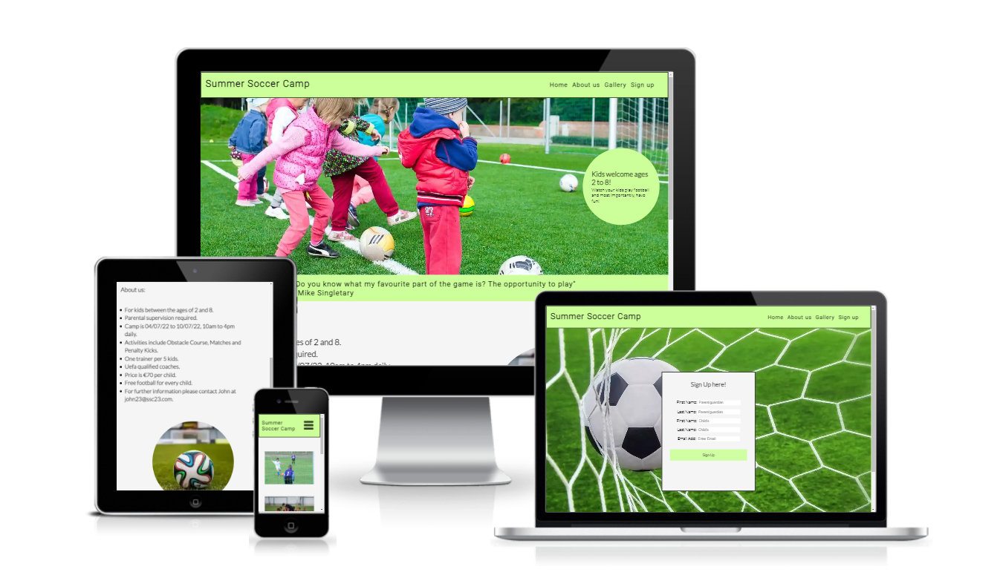
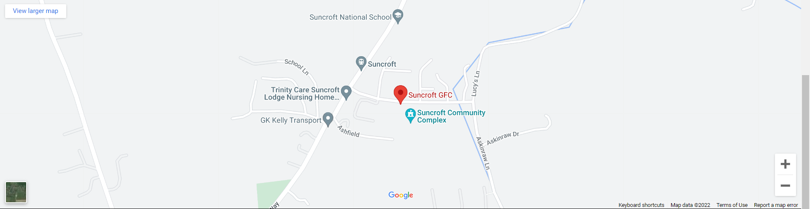
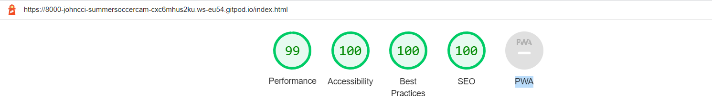
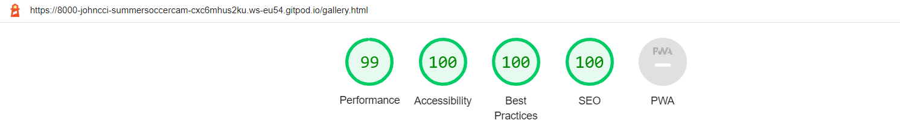

<h1 align="center">Summer Soccer Camp</h1>

## <U>**Motivation**</U>
The Summer Soccer Camp website was created to advertise a soccer camp for children in Suncroft, co. Kildare. It's goal is to encourage parents to sign up their kids to our soccer camp. My motivation for this project is based on my own involvement with training kids from a young age. When I was a child there was no such facilities or programs in place. I want to create something to give all children a great chance to develop there football abilities from a young age and to make new friends. I have found it is a great way to help them develop both physically and mentally.

The Summer Soccer Camp website is aimed at both parents and their children. The Initial view of the website will most likely be from a parent and the information provided is relative to the parent. The imagery of the website was created with the intention of making it easier for both the parent and child to gain an insight into what the camp involves. The overall aim is that the easy to find information and the imagery will allow both parent and child to reach what is often a mutual decision to attend this summer camp.

 

## <u>**Features**</u> ##

The following are images of the entire site and a brief description of the value each feature provides for the user. 
 

### **Existing Features** ###
 

* **Navigation Bar**

  * Featured on all three pages, the navigation bar located at the top of the page is fully responsive and includes links to the Logo, Home Page, About Us section, Gallery and Sign Up page. The navigation bar is identical in each page to allow easy navigation.

  * The value of the navigation bar is that it will allow users to navigate easily from page to page. The links are consistent on each page to allow the user access to any place on the website from every page. The one exception is the about us link which brings the user to content in the middle of the home page from anywhere in the website.
 

  
 

* **Landing page Image**

  * The Landing page is a photograph from a previous soccer camp. It has a text circle with the age requirements contained inside. It also has a quote from a famous sports personality underneath the image. The text circle on the image will reduce in size on smaller screen sizes.

  * This section displays an image from a previous soccer camp. It shows kids having fun performing an exercise. It is intended through the text and the image to show the age requirements and the enjoyment of participation. The quote is directly aimed at the parents or guardians of the child to encourage participation.
 

  
 

* **About us Section**

  * The about us section gives a description of the key details of the camp and a contact method by way of email for any further questions. There is also an image of a football to the right of the text for decorative purposes. On smaller screen sizes the image will move below the text to ensure a good user experience.

  * The value of this section is that it provides short but descriptive details of the camp to the user and all this information is in one place which is accessible from the nav bar on every page.
 

  
 

* **Google map**

  * This section contains a google map and was extracted from google maps. The google map will remain centered on smaller screen sizes.

  * The value of this is that it allows the user to view the location of the camp.
 

  
 

* **Footer** 

  * The footer section allows the user to access the relevant social media links for the camp. It also contains a copyright notice. The social media icons have the names of the social media sites placed underneath them. This was done to accommodate screen readers. The footer is fully reposnsive.

  * The value of the footer is that it helps the user to keep in contact through the social media icons displayed to encourage them to gain further insight into the camp and keep updated of any future camps. It is also displayed on each page.
 

  
 

* **Gallery** 

  * The gallery consists of four images taken from previous camps. The gallery is fully responsive. The images will display vertically on smaller screen sizes.

  * The gallery is valuable to the user as it allows them to gain insight of the camp by viewing images of previous camps. It also allows them to show the child the camp activities if encouragement to sign up for the camp is required.
 

  
 

* **Sign up page**

  * The sign up page contains a sign up form for the camp and a background image of a football hitting a net. The input headings for each text box will display above the boxes on smaller screen sizes

  * The sign up page is of value to the user as it allows them to fill out a simple sign up form to register for the camp. The sign up form allows the user to enter their own name and the childs name. The sign up form can be submitted multiple times by the same user to allow for multiple registrations.
 

  
 

## <u>**User Experience**</u>

### **Initial Discussion**

The Summer Soccer camp is an online webpage that introduces potential clients from a localised area to a week long soccer camp for children. The pages include past images of the camp, a simple online registration form and a brief description of what activities kids will be able to participate in at the camp. It also includes an interactive google map segment which allows users to view directions to the camp.
 

* **Key Information**

  * What we do at the camp.
  * Where the camp is located.
  * How do I sign up.
  * The level of qualifications held by coaches.
  * The cost of the camp.
  * The gift for the children on completion of the camp.
  * That parents must attend for supervisory reasons.
  * The age requirement to attend the camp.
 

* **Client Goals**

  * To be able to view the site on a range of devices including a smartphone, a tablet and a laptop.
  * To make the site informative without having to much information to allow users to easily see the essential details.
  * To provide easy navigation throughout the site so users can easily navigate to and from different pages and sections of pages.
  * To provide a simple sign up form to allow users to register in seconds.
  * To provide a method of locating the camp.
 

* **First Time Visitor Goals**

  * I want to find out what the camp is and how I can sign my child up.
  * I want to be able to navigate the site with ease to collect all the information I require to make a decision in joining.
  * I want to be able to navigate to the social media platforms to gain further perspective on the camp.
 

* **Returning Visitor Goals**

  * I have talked to the relevant people at home and now want to return to sign up for the camp.
  * I want to be able to contact the camp with any questions I may have.
 
 
* **Frequent Visitor Goals**

  * I want to return to this site for updates on new camp dates in the future. I also want to use the social media links as a further method of keeping up to date on future camps.
 

## <u>**Designs**</u>

* **Colour Scheme**

  * The below image was taken from the website colorhexa.com and it is an example of the main colour displayed in this site. The original colour picked was a light green colour with a value of #ccf381. This colour was selected in place of #ccf381 as it is considered a web safe colour as shown in colorhexa.com. 
  The other colours displayed on the site are whitesmoke and black. The whitesmoke colour was chosen for the purpose of emphasising the foreground display. Black was used for all font colours with red used for all hover actions.

  * The website used for the colour scheme is [Color hexa](https://www.colorhexa.com/ccff99). I have attached a screenshot form the website of the particular colour used.
 

  
 

* **Font-family**

  * Roboto was used for the headings on the site. It is a Sans-Serif font. The back up font selected was San-Serif.

  * Lato was used for the body of the site. It is also a Sans-Serif font. The back up font selected was Sans-Serif.

* **Imagery**

  * All imagery was used with the permission of their owners. I have credited all of these in the Credits section of this README.md File.
 

## <U>**Accessibility**</U>

* I have been conscientious of achieving the maximum amount of accessibility possible by completing the following actions:

  * Using semantic HTML.

  * Using alt attribute with images on the site. There are two exceptions to the use of alt attributes. The first is the main image on the home page which has a text circle inserted to assist screen readers and the background image on the sign up page which is there for background decorative purposes.

  * Ensuring sufficent colour contrast throughout the site

  * Adding text to the social media elements on the footer to assist screen readers.
 

## <U>**Technologies Implemented**</U>

* The following technologies were implemented in the construction and design of this website.

  * HTML and CSS - To create this website.

  * Git - For version control.

  * Github - To save and store the files for the website construction.

  * Google Fonts - To import the fonts used on the website.

  * Font awesome - To create the social media icons on the footer.

  * Google dev tools - To troubleshoot and test features and to monitor and adjust the website to ensure it is responsive.

  * Am I Responsive? - To show the website image on a range of devices.

  * Ezgif.com - To optimize images.
 

## <U>**Testing and Bugs**</U>

* Testing was an ongoing process from the start to the finish of the build. I used a chrome developer tools to assist me in solving problems as I progressed through the project. I encountered the following build issues and bugs as I progressed through the project.

  * The main image would not conform to my intended page size. At this point in the project I was using float elements to align my page. I then learned how to use flex properties and when I used flex properties it was easier to align the main image.

  * The image in the about us section on the home page was creating a white margin on the right of the page when screen width reached 487px. I identified this issue using chrome developer tools. I applied an overflow value of hidden to the relevant media query to prevent this from happening.

  * The lighthouse test on developer tools is displaying a score of 75 for performance on the mobile text. I discussed this with my mentor and the possible explanation is the size of the main image and reached a conclusion which I discuss in the lighthouse section later in this readme.md file.

  * The form name element in the input id for parent did not have sufficient indiviual detail as highlighted by my mentor. This was causing a problem when submitting the form as there are two submission fields for parent/guardian and child.

  * I encountered difficulty postioning in the home page with the about us section. I was using float properties at this time, I could not get the image div and the text div to display side by side. I spoke to my mentor about my positioning problems and he recommended flex positioning. I changed to using flex properties and this made it easier for me to position these elements.

  * The hamburger menu would not display as expected on small screen sizes. I spoke to my mentor who reviewed this issue and told me to look at my media queries overlapping. The problem was that the small screen size was being overuled by larger screen sizes which had the CSS command of display:None;. I addressed this issue by creating a minimum width media query which prevented the larger screen media query from passing down to the smaller screens. This was all achieved with assistance from my mentor.
 

## <U>**W3C Validator**</U>

* The W3C validator was used to to validate the html on all pages of this website. No errors were returned when passing through the W3C validator.
 
  * [Home Page HTML](https://validator.w3.org/nu/?doc=https%3A%2F%2F8000-johncci-soccercampforki-lzzw06ry160.ws-eu54.gitpod.io%2Findex.html)
  * [Gallery Page HTML](https://validator.w3.org/nu/?doc=https%3A%2F%2F8000-johncci-soccercampforki-lzzw06ry160.ws-eu54.gitpod.io%2Fgallery.html)
  * [Sign Up Page HTML](https://validator.w3.org/nu/?doc=https%3A%2F%2F8000-johncci-soccercampforki-lzzw06ry160.ws-eu54.gitpod.io%2Fsignup.html)
 

* The official Jigsaw Validator was used to validate the CSS on the website. No errors were found when passing through the Jigsaw validator.
 

 

## **Final Testing User Goals** 

* Device testing

  * I performed testing on the following devices - Samsung S21+ , Samsung S10 and Huawei MateBook D15. I also used google chrome developer tools to check the sites responsiveness on the following devices - iPhone SE, iphone XR, iphone 12 pro, Pixel 5, Samsung Galaxy S8, Samsung Galaxy S20 Ultra, ipad Air, Surface Pro 7, Surface Duo, Galaxy Fold, Samsung Galaxy A51/71, Nest Hub, Nest Hub Max. All tests showed the website to perform as expected.

* Browser testing

  * I performed testing on using the following browsers - Google Chrome ,Safari ,Mozilla Firefox. All tests showed the website to perform as expected.

* Header

  * I tested the logo and nav bar to ensure that the links worked as expected from the home page. Each link brought me to the required location when selected.

  * I tested the logo and nav bar to ensure that all links worked as expected from the gallery page. Each link brought me to the required location when selected.

  * I tested the logo and nav bar to ensure that the links worked as expected from the sing up page. Each link brought me to the required location when selected.

* Google map

  * I tested the google map and it worked as expected. It is centered over the location of the camp. It also has an option of an ariel view. 

* Footer Links

   * I tested each link on the home page. Each link worked as expected, and any links leading to external pages opened correctly in a seperate browser tab.
   * I tested each link on the gallery page. Each link worked as expected, and any links leading to external pages opened correctly in a seperate browser tab.
   * I tested each link on the sign up page. Each link worked as expected, and any links leading to external pages opened correctly in a seperate browser tab.

* Sign Up Form

  * I filled out just the email address and attempted to sign up and an icon appeared on the first name field at the top stating to fill out this field.

  * I filled out the first name field and the email address and attempted to sign up, an icon appeared directing me to fill out the last name field.

  * I filled out the first name field, the email address and the last name field, I attempted to sign up and an icon appeared telling me to fill out the childs first name field.

  * I filled out the first name field, the email address, the last name field and the childs first name field, I attempted to submit and an icon appeared telling me to fill out the childs last name field.

  * I filled out all fields and the form submitted correctly.

  * I tryed multiple combinations of all the fields with leaving some empty and the form would not submit unless all fields were filled in.
 

## <u>**LightHouse**</u>

* I applied the lighthouse tool to this project which is located in the Chrome Developer Tools. There are four areas tested in the lighthouse test.

  * Performance
  * Accessibility
  * Best Practices
  * SEO
 

### **Home Page**

The following images in this section are displayed as lighthouse desktop as the first image and lighthouse mobile as the second image.
 

1. The image below displays the lighthouse desktop score for the home page. The performance score was diplaying as 76 on a mobile device and 85 on a desktop device. I consulted with my mentor about the score and he informed me the size of the main image was having a negative impact on performance score.

2. I used the website [ezgif.com](https://ezgif.com/) to address this problem. I resized image and this increased the performance score to 99 on the desktop devices and 95 on the mobile devices. The increase in score came directly as a result of these changes as confirmed through retesting.

 

### **Gallery Page**

The following images in this section are displayed as lighthouse desktop as the first image and lighthouse mobile as the second image.
 

1. The Image displayed below displays a desktop score of 100 for every section. The first lighthouse mobile score was 86 for performance and 93 on desktop.

2. The performance issue was addressed by converting the largest image file to webp and by changing the aspect ratio of the images using ezgif. The performance score increased to 100 on desktop and 99 on mobile.

 

### **Sign Up Page**

The following images in this section are displayed as lighthouse desktop as the first image and lighthouse mobile as the second image.
 

1. The background image on this page was effecting perfomance. The lighthouse suggestion was to serve the image in a next gen format. The original perfomance score was 89.

2. I addressed this issue by again using ezgif.com and increased the performance score to 96. 

 

## <u>**Deployment and Local Development**</u>

### **Deployment**

The live website was deployed by following the instructions below. Github pages was used to achieve this.

  1. Log in to GitHub.
  2. Find the repository named summer-soccer-camp.
  3. click on the settings link.
  4. Once in settings, navigate to the pages tab on the side menu.
  5. Under source, Select the branch to main, then click save.
  6. Once the main branch has been selected, the page will be automatically refreshed with a detailed ribbon display to indicate a successful deployment.
 

  ### **Local Development**

To fork the summer-soccer-camp repository:

  1. Log in to GitHub.
  2. Go to the repository for this project, johncci/summer-soccer-camp.
  3. Click the fork button located near the top right corner of the page.
 

To clone the summer-soccer-camp repository:
  1. Log in (or sign up) to GitHub.
  2. Go to the repository for this project, johncci/summer-soccer-camp.
  3. Click on the code button, select whether you would like to clone with HTTPS, SSH or GitHub CLI and copy the link shown.
  4. Open the terminal in your code editor and change the current working directory to the location you want to use for the cloned directory.
  5. Type 'git clone' into the terminal and then paste the link you copied in step 3. Press enter.
 

## <u>**Credits**</u>

### **Content**

  * The code in the [Sign up form button](https://www.w3schools.com/HOWTO/tryit.asp?filename=tryhow_css_signup_form) was extracted from W3C schools. I then added my own colour style to suit the website design.

  * The JavaScript used for the hamburger menu on smaller screen sizes was written by Harsh Chandra a software developer. I wanted the burger menu for smaller screen sizes but I did not have the knowledge to accomplish it by myself. I personally wrote the CSS and HTML for the hamburger menu with assistance from Harsh Chandra.

  * The began this project using float properties but I then learned of an easier way to psotion items using flex. I learned how to apply [Flex Positioning](https://www.w3schools.com/css/css3_flexbox.asp) at W3C schools.
 

### **Media**

  * The main image used on the home page is from [pexels.com](https://www.pexels.com/).
  * The image in the about us section is from [pexels.com](https://www.pexels.com/).
  * The image on the gallery page of the child tying the laces on his football boots is from [pexels.com](https://www.pexels.com/).
  * The image on the gallery page of the coach instructing children is from [unsplash.com](https://unsplash.com/).
  * The image on the gallery page of children playing soccer together is from [freeimages.com](https://www.freeimages.com/).
  * The image on the gallery page of a ball being kicked towards the goalkeeper id from [freeimages.com](https://www.freeimages.com/).
  * The image on the sign up page of a football hitting a football net was taken from [wallpaperaccess.com](https://wallpaperaccess.com/)
  * The social media icons on the footer were taken from [fontawesome.com](https://fontawesome.com/).
  * The embedded google map was taken from [googlemaps.com](https://www.google.com/maps/@53.1167628,-6.8752443,14z).
  * The icon for the burger menu was taken from [icon-libarary.com](https://icon-library.com/).
  * The quote on the home page by Mike Singletary was taken from [brainyquote.com](https://www.brainyquote.com/).
  * The images on this site were changed from there original settings using [ezgif.com](https://ezgif.com/).
  * The font for this page was set using [googlefonts.com](https://fonts.google.com/). 

  All media listed above was used with the permission of the owner.
 

  ### **Acknowledgments**

  I would like to thank the following people who gave up their time to help me in completing this website.

    * Antonio Rodriguez - My Mentor who offered his help both my appointments and outside appointment hours and never failed to point me in the right direction when I was struggling to find solutions to problems.

    * Code Institute Tutors - For helping me with my website positioning and most importantly for spotting an error in a file name.

    * Jim Sawyer - For taking the time to discuss the best way for me to successfully complete this website and for providing moral support.

    * Harsh Chandra - For helping me write JavaScript code to create a functional Hamburger Menu and for helping me learn more about flex positioning.

